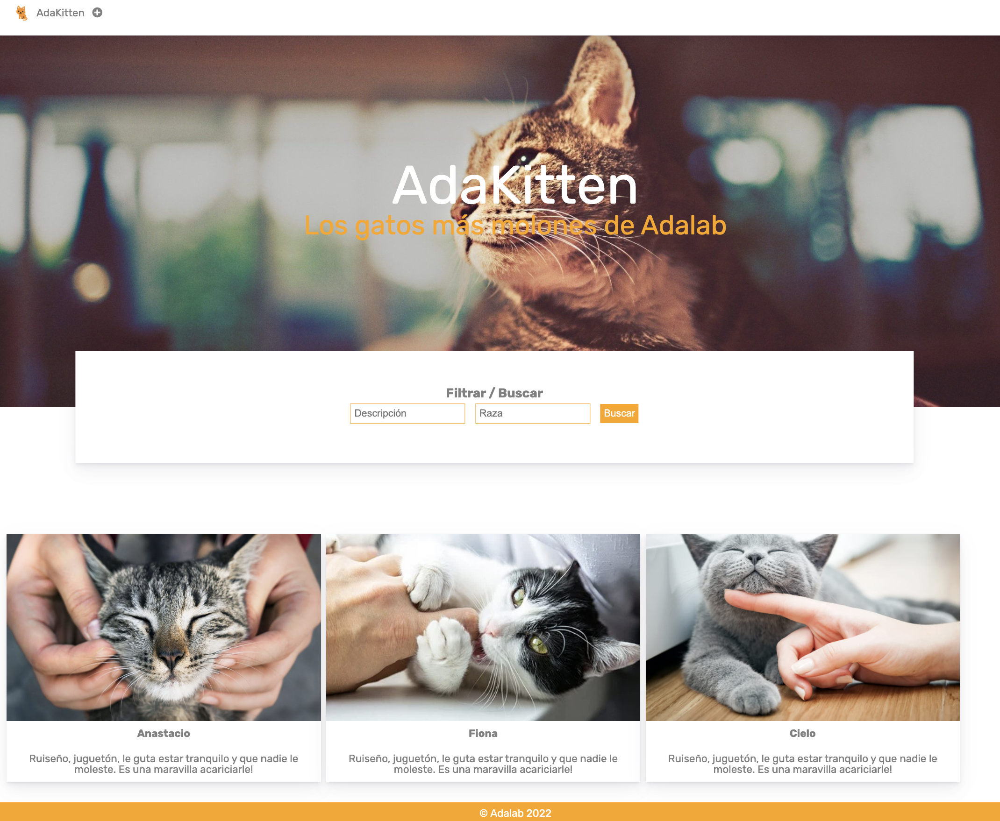

# Ejercicio para el pair programming de Cristina y Clara

Hemos creado este ejercicio para que lo hagáis durante la hora de pair programming entre tu compañera y tú. Este ejercicio es incremental, es decir, cada día vamos a ir añadiendo las nuevas funcionalidades que hemos aprendido.

- En estos materiales encontraréis el enunciado de las tareas que debes hacer cada día.
- Es obligatorio que lo hagáis en la hora de pair programming.
- Aquí os enseñamos trucos y buenas prácticas.
- Cuando a mitad de módulo cambies de pareja tendrás que seguir trabajando sobre tu ejercicio o el de tu nueva pareja.

# Aplicación AdaKitten 🐈

¿A quién no le gustan los gatitos 🐈? Las mascotas forman parte de nuestra vida, son nuestra familia, compañeros de trabajo, y seguro que ahora mismo muchas de nosotras tenemos uno o varios a nuestro lado.
Os proponemos trabajar en AdaKitten🐈, una aplicación donde guardamos la información de los gatitos que pasan por Adalab. ¿Te apuntas a programar desde cero esta aplicación?

### Descripción de la aplicación

El objetivo de la aplicación es guardar información general sobre gatos, y hemos elegido hacerlo con los gatos de las Adalabers. Esta aplicación es replicable y extensible a cualquier temática: perros, listado de productos, contactos.

La aplicación está compuesta por una única página que contiene:

1. Una cabecera que contiene una sección para buscar por un nombre, raza o alguna característica.

2. La sección principal es un listado en forma de tarjetas donde se muestra la información de los gatitos: foto, nombre, raza, y una descripción para contar lo que hace único a cada gato.

3. Por último, podemos añadir nuevos gatitos pulsando sobre el botón "+" que mostrará un formulario para rellenar los datos.

### ¿Qué encontramos en este repositorio ?

En este repositorio encontrarás el html y los estilos de la página, aunque puedes cambiar la visualidad de la aplicación si queréis y ser tan creativas como queraís. Os recomendamos que lo hagáis luego que hayamos terminado el curso, ahora nos concentraremos en JS.

Para que sepáis que vamos haciendo durante el módulo, os dejamos el listado de tareas que tienen que completar por lección, asi saben cada momento por donde váis.

La solución del ejercicio completo se subirá al final del módulo, si en una sesión de pair programing no habéis terminado el ejercicio, lo continúan al día siguiente, lo importante es que vayáis aprendiendo y entendáis lo que hacen.

#### Listado de ejercicios por lección:

Por favor marca a continuación los ejercicios que hayáis terminado:

> **2.1 Intro a la programación**

- [x] 1. Crea el proyecto
- [ ] 2. Entiende el código html y css del proyecto
- [ ] 3. Modificar clases CSS desde JS
- [ ] 4. Guarda la información en variables

> **2.2. Intro a la programación II**

- [ ] 1. Trabajar con variables e interpolarlas
- [ ] 2.  Bonus: Convertir cadenas de carácteres
- [ ] 3. Bonus: Reemplaza contenido

> **2.3. Condicionales**

- [ ] 1. Búsqueda por descripción
- [ ] 2. Mostrar/ocultar el formulario añadir
- [ ] 3. Bonus: No se ha especificado la raza, ¿qué se muestra entonces?

> **2.4. Eventos**

- [ ] 1. Mostrar/ocultar formulario
- [ ] 2. Validar formulario nuevo gatito
- [ ] 3. Validar formulario búsqueda

> **2.5. Funciones**

- [ ] 1. Mostrar/ocultar el formulario nuevo gatito
- [ ] 2. Mostrar la raza o no
- [ ] 3. Crear el gatito en HTML

> **2.6. Objetos**

- [ ] 1. Convertir cada gatito en un objeto

> **2.7. Arrays y Bucles**

- [ ] 1. Crear listado de gatitos

> **2.9. Arrays y Bucles II**

- [ ] 1. Un nuevo proyecto con tu pareja
- [ ] 2.  Agregar un nuevo gatito al listado

> **2.10. Peticiones al servidor**

- [ ] 1. Obtener listado de gatitos desde el servidor

> **2.11. Peticiones al servidor II**

- [ ] 1. Agregar un nuevo gatito al listado

> **2.12. Métodos funcionales de array**

- [ ] 1. Filtrar por descripción
- [ ] 2. Filtrar por raza y por descripción

> **2.13. DOM Avanzado**

- [ ] 1.  Cambiar a DOM Avanzado
